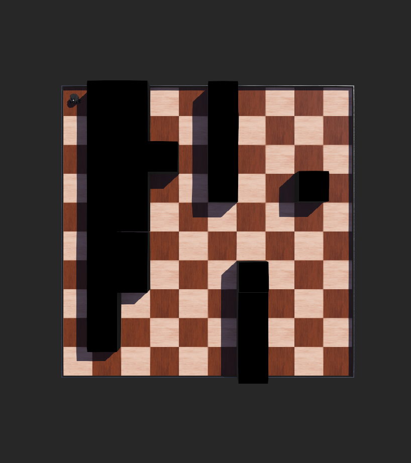
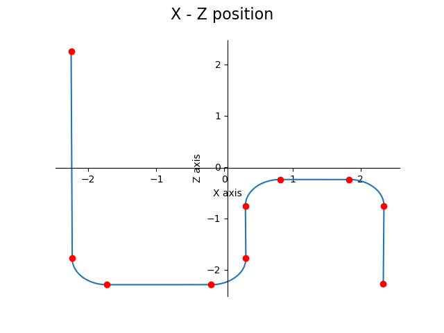

It's a joint work between - 
- [Yash Patel](https://www.github.com/yyashpatel)
- [Dhruv Patel](https://www.github.com/yyashpatel)

# Implementation of A* and Path smoothing.

This project involves the implementation of A* planner. After obtaining the path, control commands (i.e. velocity to the left and right wheels) were provided to the turtlebot3 to follow the obtained trajectory.

Two controllers have been implemented, which can be found in the controllers folder.

1. AstarPlanner - This implementation does not include path smoothing. The control commands are given to the robot with smoothing the path. So, the robot will take sharp 90 degree turns at the turning junctions.
2. call_Astar   - This implementation smooths the sharp 90 degree turns using circular arc technique. 

## Environment

The environment consist of a 10*10 grid in WEBOTS, which can be seen below. The northwest corner is the start point of the robot and south east corner is the goal position of the robot. The black box denotes the obstacles in the environment. 

&nbsp;&nbsp;&nbsp;&nbsp;&nbsp;&nbsp;&nbsp;&nbsp;&nbsp;&nbsp;&nbsp;&nbsp;&nbsp;&nbsp;&nbsp;&nbsp;&nbsp;&nbsp;&nbsp;&nbsp;&nbsp;&nbsp;&nbsp;&nbsp;&nbsp;&nbsp;&nbsp;&nbsp;&nbsp;&nbsp;&nbsp;&nbsp;&nbsp;&nbsp;&nbsp;&nbsp;&nbsp;&nbsp;&nbsp;&nbsp;&nbsp;&nbsp;&nbsp;&nbsp;&nbsp;&nbsp;&nbsp;&nbsp;&nbsp;&nbsp;&nbsp;&nbsp;&nbsp;&nbsp;

### Demonstration of A* without Path Smoothing.

https://user-images.githubusercontent.com/30457807/143781652-43151e41-e2c9-490f-a69b-9707e80b8993.mp4

### Demonstration of A* with Path Smoothing.

https://user-images.githubusercontent.com/30457807/143781670-f0218615-018b-4831-a8e3-12b24108e1ac.mp4

### Path trajectory of the Robot after smoothing the path.

&nbsp;&nbsp;&nbsp;&nbsp;&nbsp;&nbsp;&nbsp;&nbsp;&nbsp;&nbsp;&nbsp;&nbsp;&nbsp;&nbsp;&nbsp;&nbsp;&nbsp;&nbsp;&nbsp;&nbsp;&nbsp;&nbsp;&nbsp;&nbsp;&nbsp;&nbsp;&nbsp;&nbsp;&nbsp;&nbsp;&nbsp;&nbsp;&nbsp;&nbsp;&nbsp;&nbsp;&nbsp;&nbsp;&nbsp;&nbsp;&nbsp;&nbsp;&nbsp;&nbsp;&nbsp;&nbsp;&nbsp;&nbsp;&nbsp;&nbsp;&nbsp; 

The red dot denotes the intermidiate waypoints, start node and goal node. 
